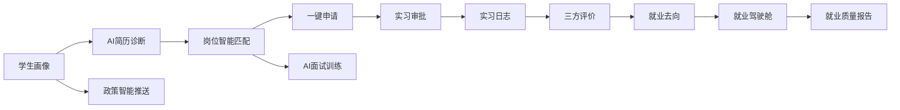

# Fit Job · 一面AI就业实习云平台

> 面向中国软件杯赛题的大学生就业实习全链路智能服务系统。  
> 第一阶段先交付可运行的高质量 Web 原型，后续接入金蝶 AI 苍穹低代码平台、Java 插件、Agent 智能体、RAG 知识库与就业数据驾驶舱。

## 在线预览

[https://lizinian-42.github.io/fit-job/](https://lizinian-42.github.io/fit-job/)

预览版本由 `.github/workflows/deploy-preview.yml` 构建并发布，使用匿名 Mock 数据，不连接真实业务系统。

## 项目定位

Fit Job 是一个面向高校学生、辅导员、企业 HR 与院系管理员的就业实习智能服务系统，围绕“求职准备、岗位匹配、实习申请、过程管理、就业分析、政策触达”形成完整业务闭环。

项目设计参考：

- [lizinian-42/FirstFit-AI](https://github.com/lizinian-42/FirstFit-AI)：参考其智能简历、JD 六维拟合、模拟面试、成长档案与 AI 编排经验。
- [MadsLorentzen/ai-job-search](https://github.com/MadsLorentzen/ai-job-search)：参考其单一事实源、岗位搜索/排序/申请/面试/结果回流的工程化工作流。
- [VoltAgent/awesome-design-md](https://github.com/VoltAgent/awesome-design-md)：参考其 React 前端设计素材组织方式，辅助第一阶段打造清爽、高级、要素明确的 Web 原型。

## 赛题目标映射

| 赛题要求 | Fit Job 对应模块 |
| --- | --- |
| 简历优化 | AI 简历诊断、结构化简历、优化建议、版本记录 |
| 岗位匹配 | 学生画像、岗位库、六维匹配评分、推荐解释 |
| 实习申请 | 学生申请、辅导员审核、院系审核、企业确认 |
| 过程管理 | 实习日志、中期检查、三方评价、风险预警 |
| AI 面试训练 | HR 面、技术/业务面、综合素质面、训练报告 |
| 政策问答 | 就业政策 RAG 知识库、引用来源、多轮问答 |
| 数据分析 | 就业率、行业分布、薪资区间、就业质量报告 |

## 技术路线

项目采用“Web 原型先行、苍穹平台落地、Java 能力增强”的技术路线。

### 第一阶段：KWC Web 原型

用于快速验证信息架构、视觉风格、核心交互和演示故事线。

- 金蝶 KWC 组件与苍穹页面元数据
- JavaScript、HTML、CSS
- Rollup 构建
- 本地匿名 Mock 数据契约
- GitHub Pages 静态预览

第一阶段目标是交付一个可运行的 Web 原型，覆盖：

- 首页/产品叙事页
- 学生工作台
- AI 简历诊断页
- 岗位推荐与六维匹配页
- AI 面试训练页
- 政策问答页
- 院系就业驾驶舱页

### 第二阶段：金蝶 AI 苍穹平台

作为软件杯作品的主系统承载层。

- 苍穹低代码表单模型
- 苍穹流程模型
- 苍穹服务模型
- 苍穹权限模型
- 苍穹报表模型
- 苍穹 AI 智能知识引擎
- Agent 智能体、RAG 知识库、任务流编排、工具调用
- KWC 前端框架，用于复杂页面和高交互组件

### 第三阶段：Java 插件与云原生服务

用于承载确定性业务逻辑、复杂评分、AI 调用封装与数据处理。

- Java 17+
- 苍穹 Java 表单/操作/服务插件
- Spring Boot 辅助微服务
- PostgreSQL
- Maven 或 Gradle
- JUnit 5

建议 Java 能力边界：

- 岗位六维匹配评分
- AI 调用日志与结果校验
- 政策推送规则
- 实习风险预警
- 就业质量报告数据聚合

## 核心业务闭环



## Agent 能力中心

| Agent | 输入 | 输出 |
| --- | --- | --- |
| 简历诊断 Agent | 学生档案、简历文本、目标岗位 | 优势、不足、关键词缺口、优化建议 |
| 岗位匹配 Agent | 学生画像、岗位 JD、规则分数 | 推荐解释、短板说明、准备建议 |
| 面试训练 Agent | 简历、岗位、面试轮次 | 多轮问题、回答评分、训练报告 |
| 政策问答 Agent | 学生画像、政策知识库、用户问题 | 带来源引用的政策答案 |
| 就业分析 Agent | 驾驶舱指标、就业数据 | 就业趋势、风险提醒、管理建议 |

## 数据与模拟样例

比赛数据全部使用模拟数据，禁止包含真实学生个人信息。

计划准备：

- 50 条模拟学生档案
- 60 条模拟岗位
- 15 家模拟企业
- 80 条政策知识库条目
- 100 条实习日志
- 30 条面试训练记录
- 50 条就业去向记录

## 三阶段计划

### M1：高质量 KWC Web 原型

目标：完成可运行、清爽、高级、要素明确的 Web 原型，为后续苍穹页面和答辩演示提供视觉基准。

关键交付：

- KWC 项目骨架与苍穹页面元数据
- 产品首页和核心业务页面
- Mock 数据与图表
- 统一设计系统
- 可部署预览版本

### M2：苍穹低代码业务闭环与 AI 能力中心

目标：完成金蝶 AI 苍穹平台上的表单、权限、流程、Agent、RAG 与 Java 能力骨架。

关键交付：

- 四类角色权限
- 学生档案、岗位、申请、实习、评价等表单模型
- 实习申请流程
- 简历诊断、岗位匹配、面试训练、政策问答 Agent
- Java 六维匹配服务

### M3：实习管理、驾驶舱与答辩交付

目标：完成全链路演示、就业数据驾驶舱、平台证明材料与答辩材料。

关键交付：

- 实习日志与三方评价
- 实习风险预警
- 就业驾驶舱
- AI 就业质量报告
- 平台配置截图与演示录屏

## GitHub 工作流

本仓库使用 GitHub Issues、Milestones 与 Labels 管理开发。

建议标签维度：

- `area:web`
- `area:java`
- `area:cangqiong`
- `area:agent`
- `area:rag`
- `area:data`
- `area:docs`
- `area:design`
- `area:dashboard`
- `priority:p0`
- `priority:p1`
- `priority:p2`

## 本地启动与构建

```bash
cd platform/kwc/fit-job-kwc
npm ci
npm run dev
```

完整检查与苍穹组件构建：

```bash
npm run check
```

苍穹 M2 模型、权限、流程与 Mock 一致性检查：

```bash
cd platform/cangqiong
npm run check
```

GitHub Pages 静态预览构建：

```bash
npm run build:preview
```

## 阶段文档

- [M1 阶段总结](docs/m1-stage-summary.md)
- [M1 Mock 数据契约](docs/m1-mock-data-contract.md)
- [M2 苍穹与 AI 能力对接指南](docs/m2-integration-guide.md)
- [苍穹表单模型设计](docs/cangqiong-form-models.md)
- [四类角色权限矩阵](docs/cangqiong-permission-matrix.md)
- [岗位申请与实习审批流程](docs/cangqiong-application-workflows.md)

## 许可证

本项目遵循仓库内 LICENSE。
