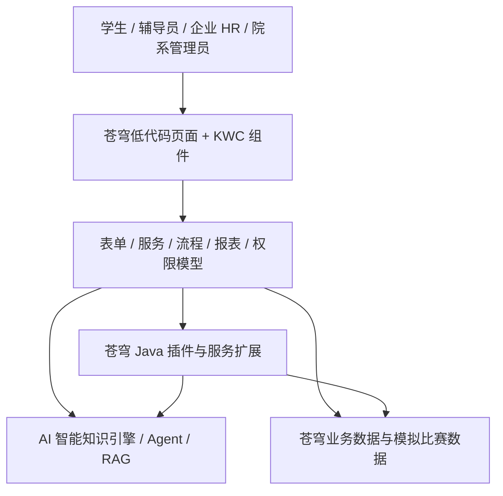
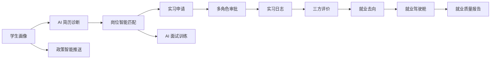

# Fit Job · 一面 AI 就业实习云平台

> 面向中国软件杯赛题的大学生就业实习全链路智能服务系统。正式作品以金蝶 AI 苍穹开发平台为主系统，前端采用苍穹低代码页面与 KWC 前端框架，后端能力通过苍穹 Java 插件或平台允许的 Java 服务实现。

## 赛题技术约束

本项目不采用 React、Vue 或独立 Vite SPA 作为正式前端。赛题要求决定了以下技术路线：

- 使用金蝶 AI 苍穹开发平台与低代码开发平台；
- 标准业务页面优先使用表单模型和平台控件；
- 复杂页面、可视化和高交互组件使用 KWC 前端框架；
- 业务闭环使用服务模型、流程模型、报表模型和权限模型；
- AI 能力使用苍穹 AI 智能知识引擎、Agent、RAG、任务流和工具调用；
- 确定性业务逻辑、复杂评分与平台扩展使用 Java；
- JDK、Maven/Gradle、KWC 工具链版本以目标苍穹环境和官方脚手架为准，仓库不自行猜测或锁定不兼容版本。

## 项目定位

Fit Job 面向高校学生、辅导员、企业 HR 与院系管理员，围绕“求职准备、岗位匹配、实习申请、过程管理、就业分析、政策触达”形成完整业务闭环。

| 赛题能力 | Fit Job 模块 | 苍穹承载方式 |
| --- | --- | --- |
| 简历优化 | AI 简历诊断、结构化简历、版本记录 | 表单模型 + Agent + Java 校验 |
| 岗位匹配 | 学生画像、岗位库、六维匹配、推荐解释 | 服务模型 + Java 评分 + KWC 可视化 |
| 实习申请 | 学生申请、辅导员审核、院系审核、企业确认 | 表单模型 + 流程模型 + 权限模型 |
| 过程管理 | 实习日志、中期检查、三方评价、风险预警 | 表单模型 + 流程模型 + Java 规则 |
| AI 面试训练 | 多轮面试、回答评分、训练报告 | Agent + 服务模型 + KWC 交互组件 |
| 政策问答 | 政策知识库、来源引用、多轮问答 | RAG 知识库 + Agent |
| 数据分析 | 就业率、行业分布、薪资区间、质量报告 | 报表模型 + KWC 驾驶舱 |

## 总体架构



### 技术边界

| 层次 | 负责内容 | 不负责内容 |
| --- | --- | --- |
| 苍穹低代码 | 标准表单、列表、基础校验、流程发起与审批、权限控制 | 不为追求“炫技”重写成熟平台控件 |
| KWC | 六维匹配图、复杂诊断面板、面试交互、驾驶舱组合组件 | 不替代全部低代码页面，不引入 React 架构 |
| Java | 匹配评分、风险规则、AI 调用封装、数据聚合、平台插件 | 不绕过苍穹模型直接建立第二套业务主系统 |
| AI 引擎 | 简历诊断、推荐解释、面试训练、政策问答、分析建议 | 不承担必须可审计的权限、审批和确定性规则 |

## 核心业务闭环



## 仓库结构

```text
fit-job/
├─ docs/
│  ├─ architecture.md          # 苍穹平台总体架构和边界
│  ├─ local-development.md     # 平台、KWC、Java 的协作与验证方式
│  └─ design-system.md         # 面向低代码/KWC 的视觉规范
├─ platform/
│  ├─ app-manifest.example.yaml# 应用与环境标识模板，不含密钥
│  ├─ model-inventory.md       # 表单、服务、流程、报表、权限模型清单
│  ├─ exports/                 # 苍穹平台可审查导出物
│  ├─ kwc/                     # 官方脚手架生成的 KWC 源码
│  ├─ java/                    # 官方模板生成的 Java 插件/服务源码
│  └─ ai/                      # Agent、RAG、工具协议和提示词资产
└─ scripts/
   └─ check-environment.ps1    # 仓库基线与可选 Java 工具检查
```

低代码模型的在线配置以苍穹平台为运行时事实源；仓库通过模型清单、导出文件、截图、配置说明和源码保留可追踪证据。

## 里程碑

### M1：苍穹应用与模型基线

- 创建苍穹应用、开发环境和四类角色；
- 建立表单、服务、流程、报表、权限模型清单；
- 用低代码页面完成学生档案、岗位与申请的最小闭环；
- 从官方脚手架创建 KWC 与 Java 扩展工程；
- 形成平台截图、模型导出和仓库映射关系。

### M2：AI 能力中心与实习流程

- 接入简历诊断、岗位匹配、面试训练、政策问答 Agent；
- 建立政策 RAG 知识库与来源引用；
- 完成实习申请审批流程、日志和三方评价；
- 使用 Java 实现六维匹配、风险预警和 AI 结果校验。

### M3：驾驶舱与答辩交付

- 完成就业报表模型和 KWC 驾驶舱；
- 生成就业质量报告和管理建议；
- 完成模拟数据、权限矩阵、平台证明材料、演示录屏和答辩脚本。

## 数据原则

- 比赛数据全部使用模拟数据，禁止提交真实学生个人信息；
- API Key、Token、租户信息和平台凭据不得进入仓库；
- AI 输出必须保留来源、调用日志或可解释信息；
- 权限、审批、状态迁移和关键评分应由模型或 Java 规则确定，不能只依赖大模型文本。

## 开始协作

1. 阅读 [总体架构](docs/architecture.md)；
2. 按 [模型清单](platform/model-inventory.md) 在苍穹平台创建或核对模型；
3. 复制 `platform/app-manifest.example.yaml` 为本机私有配置，并填入非敏感标识；
4. 从目标苍穹环境的官方入口生成 KWC/Java 工程后，再提交到对应目录；
5. 参考 [本地协作说明](docs/local-development.md) 完成检查和交付证据。

```powershell
.\scripts\check-environment.ps1
```

## 许可证

本项目遵循仓库内 `LICENSE`。
