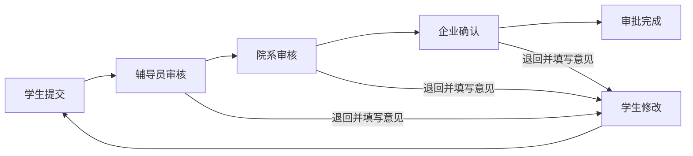

# Fit Job 苍穹流程模型设计

> 由 `platform/cangqiong/src/workflows.mjs` 生成。`workflowEngine.mjs` 是状态、角色、意见必填和幂等规则的本地可执行参考，正式运行时应映射到苍穹流程模型及服务端操作。

## 企业信息审核（`fit_company_review`）

- 业务表单：`fit_company`
- 状态字段：`reviewStatus`
- 初始状态：`DRAFT`
- 终态：`DISABLED`

### 节点与处理人

| 状态/节点 | 名称 | 处理角色 | 处理人解析 |
| --- | --- | --- | --- |
| `DRAFT` | 企业编辑 | COMPANY_HR | `record.hrOwnerUserId` |
| `PENDING_REVIEW` | 辅导员/院系审核 | COUNSELOR / DEPARTMENT_ADMIN | `department.companyReviewer` |
| `APPROVED` | 已通过 | 系统终态 | `—` |
| `REJECTED` | 退回企业修改 | COMPANY_HR | `record.hrOwnerUserId` |
| `DISABLED` | 已停用 | 系统终态 | `—` |

### 状态迁移

| 动作 | 来源状态 | 目标状态 | 执行角色 | 处理人覆盖 | 意见必填 | 必填字段/额外校验 |
| --- | --- | --- | --- | --- | --- | --- |
| `SUBMIT_REVIEW` 提交审核 | `DRAFT` / `REJECTED` | `PENDING_REVIEW` | `COMPANY_HR` | — | 否 | `companyName`、`industry`、`city`、`description` |
| `APPROVE` 审核通过 | `PENDING_REVIEW` | `APPROVED` | `COUNSELOR` / `DEPARTMENT_ADMIN` | — | 否 | — |
| `RETURN` 退回修改 | `PENDING_REVIEW` | `REJECTED` | `COUNSELOR` / `DEPARTMENT_ADMIN` | — | 是 | — |
| `DISABLE` 停用企业 | `APPROVED` | `DISABLED` | `DEPARTMENT_ADMIN` | — | 是 | — |

## 岗位发布审核（`fit_job_publish_review`）

- 业务表单：`fit_job`
- 状态字段：`publishStatus`
- 初始状态：`DRAFT`
- 终态：`CLOSED`

### 节点与处理人

| 状态/节点 | 名称 | 处理角色 | 处理人解析 |
| --- | --- | --- | --- |
| `DRAFT` | 企业编辑 | COMPANY_HR | `record.hrOwnerUserId` |
| `PENDING_REVIEW` | 岗位审核 | COUNSELOR / DEPARTMENT_ADMIN | `department.jobReviewer` |
| `PUBLISHED` | 已发布 | COMPANY_HR | `record.hrOwnerUserId` |
| `REJECTED` | 退回企业修改 | COMPANY_HR | `record.hrOwnerUserId` |
| `CLOSED` | 已关闭 | 系统终态 | `—` |

### 状态迁移

| 动作 | 来源状态 | 目标状态 | 执行角色 | 处理人覆盖 | 意见必填 | 必填字段/额外校验 |
| --- | --- | --- | --- | --- | --- | --- |
| `SUBMIT_REVIEW` 提交发布审核 | `DRAFT` / `REJECTED` | `PENDING_REVIEW` | `COMPANY_HR` | — | 否 | `companyId`、`title`、`jobType`、`city`、`salaryMin`、`salaryMax`、`salaryUnit`、`jd`、`skillRequirements`、`majorRequirements`、`applicationDeadline`、`headcount` |
| `APPROVE_PUBLISH` 审核并发布 | `PENDING_REVIEW` | `PUBLISHED` | `COUNSELOR` / `DEPARTMENT_ADMIN` | — | 否 | — |
| `RETURN` 退回修改 | `PENDING_REVIEW` | `REJECTED` | `COUNSELOR` / `DEPARTMENT_ADMIN` | — | 是 | — |
| `CLOSE` 关闭岗位 | `PUBLISHED` | `CLOSED` | `COMPANY_HR` / `DEPARTMENT_ADMIN` | `DEPARTMENT_ADMIN` | 是 | — |

## 岗位申请流程（`fit_job_application_flow`）

- 业务表单：`fit_job_application`
- 状态字段：`status`
- 初始状态：`DRAFT`
- 终态：`OFFERED`、`REJECTED`、`WITHDRAWN`

### 节点与处理人

| 状态/节点 | 名称 | 处理角色 | 处理人解析 |
| --- | --- | --- | --- |
| `DRAFT` | 申请草稿 | STUDENT | `record.studentUserId` |
| `SUBMITTED` | 辅导员审核 | COUNSELOR | `student.counselorUserId` |
| `COMPANY_REVIEW` | 企业筛选 | COMPANY_HR | `company.hrOwnerUserId` |
| `INTERVIEW` | 企业面试 | COMPANY_HR | `company.hrOwnerUserId` |
| `OFFERED` | 已录用 | 系统终态 | `—` |
| `REJECTED` | 未通过 | 系统终态 | `—` |
| `RETURNED` | 退回学生修改 | STUDENT | `record.studentUserId` |
| `WITHDRAWN` | 学生已撤回 | 系统终态 | `—` |

### 状态迁移

| 动作 | 来源状态 | 目标状态 | 执行角色 | 处理人覆盖 | 意见必填 | 必填字段/额外校验 |
| --- | --- | --- | --- | --- | --- | --- |
| `SUBMIT` 一键申请 | `DRAFT` / `RETURNED` | `SUBMITTED` | `STUDENT` | — | 否 | `createCommandId`、`studentId`、`studentUserId`、`jobId`、`companyId`、`resumeId` |
| `COUNSELOR_APPROVE` 辅导员通过 | `SUBMITTED` | `COMPANY_REVIEW` | `COUNSELOR` | — | 否 | — |
| `RETURN` 退回学生 | `SUBMITTED` | `RETURNED` | `COUNSELOR` / `DEPARTMENT_ADMIN` | `DEPARTMENT_ADMIN` | 是 | — |
| `INVITE_INTERVIEW` 邀请面试 | `COMPANY_REVIEW` | `INTERVIEW` | `COMPANY_HR` | — | 否 | — |
| `OFFER` 发放录用 | `COMPANY_REVIEW` / `INTERVIEW` | `OFFERED` | `COMPANY_HR` | — | 是 | — |
| `REJECT` 不通过 | `COMPANY_REVIEW` / `INTERVIEW` | `REJECTED` | `COMPANY_HR` | — | 是 | — |
| `WITHDRAW` 撤回申请 | `DRAFT` / `SUBMITTED` / `RETURNED` / `COMPANY_REVIEW` / `INTERVIEW` | `WITHDRAWN` | `STUDENT` | `STUDENT` | 否 | — |

## 实习申请审批（`fit_internship_approval`）

- 业务表单：`fit_internship_application`
- 状态字段：`status`
- 初始状态：`DRAFT`
- 终态：`APPROVED`、`REJECTED`、`CANCELLED`

### 节点与处理人

| 状态/节点 | 名称 | 处理角色 | 处理人解析 |
| --- | --- | --- | --- |
| `DRAFT` | 学生填写 | STUDENT | `record.studentUserId` |
| `COUNSELOR_REVIEW` | 辅导员审核 | COUNSELOR | `student.counselorUserId` |
| `DEPARTMENT_REVIEW` | 院系审核 | DEPARTMENT_ADMIN | `student.collegeCode.departmentApprover` |
| `COMPANY_CONFIRMATION` | 企业确认 | COMPANY_HR | `company.hrOwnerUserId` |
| `APPROVED` | 审批完成 | 系统终态 | `—` |
| `RETURNED` | 退回学生修改 | STUDENT | `record.studentUserId` |
| `REJECTED` | 审批拒绝 | 系统终态 | `—` |
| `CANCELLED` | 学生取消 | 系统终态 | `—` |

### 状态迁移

| 动作 | 来源状态 | 目标状态 | 执行角色 | 处理人覆盖 | 意见必填 | 必填字段/额外校验 |
| --- | --- | --- | --- | --- | --- | --- |
| `SUBMIT` 学生提交 | `DRAFT` / `RETURNED` | `COUNSELOR_REVIEW` | `STUDENT` | — | 否 | `jobApplicationId`、`studentId`、`studentUserId`、`jobId`、`companyId`、`resumeId`、`internshipStartDate`、`internshipEndDate`、`weeklyAttendanceDays`、`workCity`、`safetyCommitmentAccepted` 固定值：`safetyCommitmentAccepted=true` 关联校验：`jobApplication.status=OFFERED` |
| `COUNSELOR_APPROVE` 辅导员通过 | `COUNSELOR_REVIEW` | `DEPARTMENT_REVIEW` | `COUNSELOR` | — | 否 | — |
| `DEPARTMENT_APPROVE` 院系通过 | `DEPARTMENT_REVIEW` | `COMPANY_CONFIRMATION` | `DEPARTMENT_ADMIN` | — | 否 | — |
| `COMPANY_CONFIRM` 企业确认 | `COMPANY_CONFIRMATION` | `APPROVED` | `COMPANY_HR` | — | 是 | — |
| `RETURN` 辅导员退回学生修改 | `COUNSELOR_REVIEW` | `RETURNED` | `COUNSELOR` | — | 是 | — |
| `RETURN` 院系退回学生修改 | `DEPARTMENT_REVIEW` | `RETURNED` | `DEPARTMENT_ADMIN` | — | 是 | — |
| `RETURN` 企业退回学生修改 | `COMPANY_CONFIRMATION` | `RETURNED` | `COMPANY_HR` | — | 是 | — |
| `REJECT` 辅导员拒绝申请 | `COUNSELOR_REVIEW` | `REJECTED` | `COUNSELOR` | — | 是 | — |
| `REJECT` 院系拒绝申请 | `DEPARTMENT_REVIEW` | `REJECTED` | `DEPARTMENT_ADMIN` | — | 是 | — |
| `REJECT` 企业拒绝申请 | `COMPANY_CONFIRMATION` | `REJECTED` | `COMPANY_HR` | — | 是 | — |
| `CANCEL` 取消申请 | `DRAFT` / `COUNSELOR_REVIEW` / `DEPARTMENT_REVIEW` / `COMPANY_CONFIRMATION` / `RETURNED` | `CANCELLED` | `STUDENT` | `STUDENT` | 是 | — |

## Issue #18 主链验收

- 每次动作写入 `approvalRecords`，包含处理人、角色、来源状态、目标状态、意见、时间和幂等命令编号。
- 退回、拒绝、企业确认和录用动作强制填写意见。
- `createCommandId` 只标识创建操作，`approvalRecords.commandId` 标识每次提交/重提；同一提交命令回放原结果，新命令才允许 `RETURNED → SUBMITTED`。
- 平台通过唯一 `activeApplicationKey` 原子阻止并发重复申请；宿主在一次网络重试链中必须复用同一组命令编号。
- 实习提交必须加载状态为 `OFFERED` 的关联岗位申请，并核对学生、岗位、企业与简历完全一致。
- 实际苍穹流程截图和四角色处理记录应按证据清单归档。
